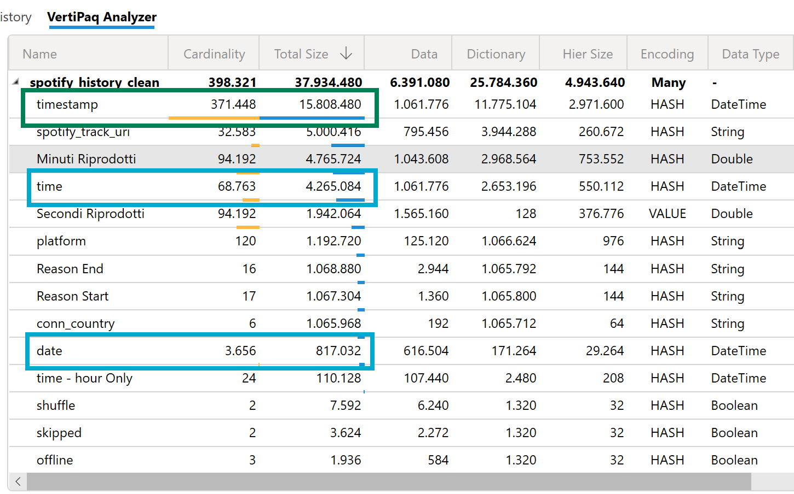

# Ottimizzazione delle colonne datetime in Power BI con VertiPaq

## ⚠️ Colonne `timestamp` ad alta cardinalità

VertiPaq, il motore di modellazione in-memory utilizzato da Power BI, utilizza un algoritmo di **compressione colonnare** che si basa fortemente sulla **cardinalità** (cioè il numero di valori distinti) delle colonne. Più bassa è la cardinalità, maggiore è l'efficienza della compressione.

Le colonne di tipo `timestamp` (data + ora) hanno **moltissimi valori distinti**, spesso **centinaia di migliaia** se non milioni. Questo rende la compressione difficile e genera:

- Maggior uso di memoria (dataset più pesanti)
- Query più lente
- Performance peggiori

---

## ✅ Spezzare `timestamp` in `date` e `time`

Una buona pratica è **separare la colonna `timestamp` in due colonne distinte**:

- `date` → contiene solo la parte di data (anno, mese, giorno)
- `time` → contiene solo la parte oraria (ora, minuti, secondi)

Questo approccio:
- Riduce la cardinalità (es. da 370.000 a 3.600 valori distinti nella `date`)
- Migliora la compressione VertiPaq
- Ottimizza le relazioni con la tabella calendario
- Riduce il tempo di caricamento e l'utilizzo di memoria

---

## 📊 Esempio pratico con VertiPaq Analyzer

👉 Come si vede nell'immagine precedente, separando la colonna `timestamp` si passa da **15.8 MB** a meno di **5.1 MB** complessivi. Un miglioramento netto.

## 📌 Conclusione

Spezzare le colonne `timestamp` è una **best practice di modellazione Power BI** che consente di:
- Aumentare la compressione
- Ridurre le dimensioni del modello
- Migliorare le performance di refresh e query

È una tecnica semplice ma molto efficace, specialmente in dataset con **dati granulari** come la cronologia di Spotify, log di eventi, o dati transazionali.
