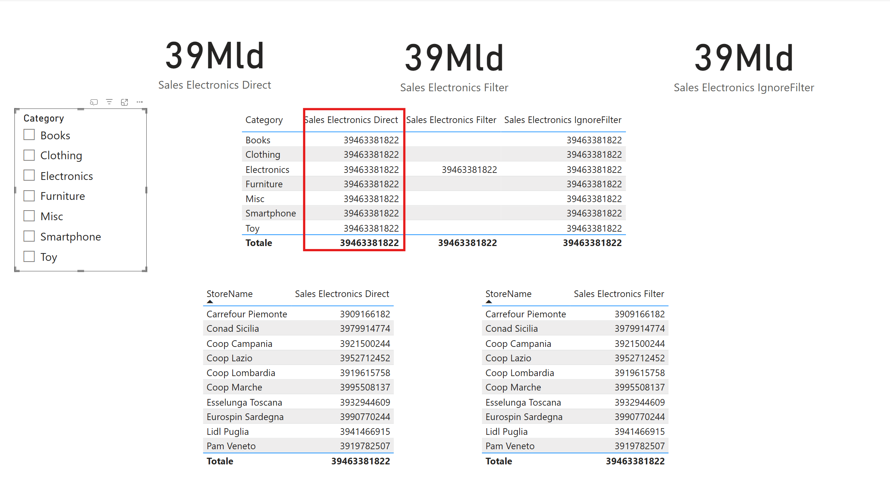
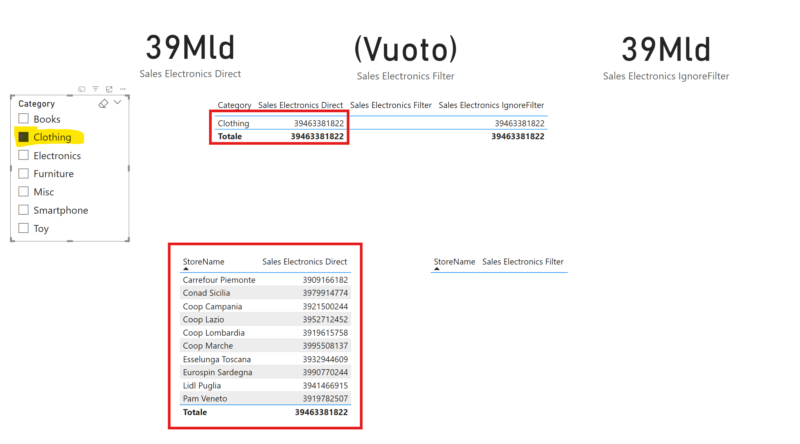
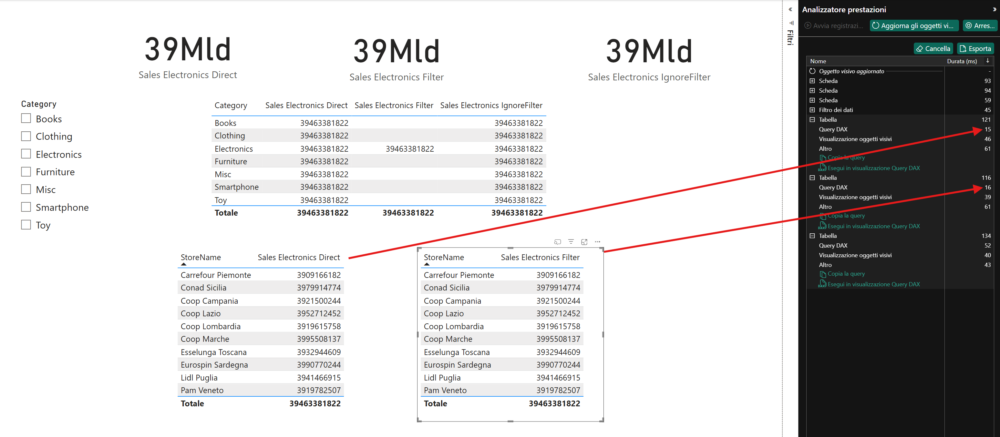
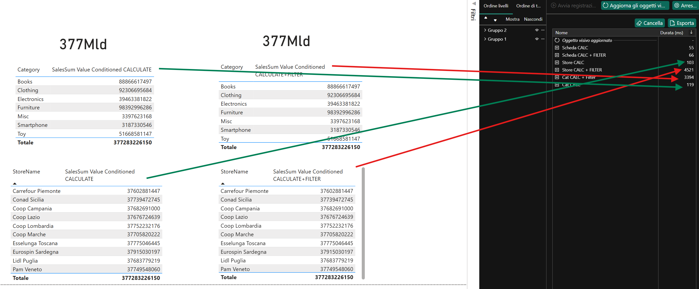

# 📊 CALCULATE VS FILTER

## 📘 Introduzione: CALCULATE e FILTER in DAX

### 🔁 `CALCULATE`

La funzione `CALCULATE` è **la più importante in DAX**. Permette di **modificare il contesto di filtro** nel quale viene valutata un'espressione.

**Sintassi:**
```DAX
CALCULATE(<espressione>, <filtro1>, <filtro2>, ...)
```

- Cambia i filtri attivi prima di calcolare l’espressione.
- Viene usata per tutti i calcoli condizionali, temporali (YTD, MTD, LY), e per la maggior parte delle misure avanzate.
- È **l’unica funzione in DAX** che può **modificare il contesto di filtro corrente**.

---

### 🔍 `FILTER`

`FILTER` crea **una tabella filtrata** in base a una condizione, che può poi essere usata come argomento dentro `CALCULATE`.

**Sintassi:**
```DAX
FILTER(<tabella>, <condizione>)
```

- Valuta riga per riga la condizione.
- Restituisce una tabella filtrata che può **raffinare** o **sovrascrivere** i filtri esistenti.
- Può essere **più lenta** di un filtro diretto, ma è molto più **flessibile**.

---

## 🧪 TEST 1 – Utilizzo di CALCULATE per filtrare un valore di una dimensione

Nel presente modello Power BI, sono state implementate tre misure DAX per calcolare le vendite relative alla categoria **"Electronics"**. Le misure utilizzano varianti della funzione `CALCULATE`, con o senza `FILTER` e `ALL`, al fine di dimostrarne il comportamento e le implicazioni logiche.

Le misure sono costruite sulla tabella dei fatti `daily_sales` e fanno riferimento alla dimensione dei prodotti `products_with_brands_and_descriptions`.

---

## ⚙️ 1. `Sales Electronics Direct`

```DAX
Sales Electronics Direct = 
CALCULATE(
    SUM('daily_sales'[SalesValue]),
    'products_with_brands_and_descriptions'[Category] = "Electronics"
)
```

### ✅ **Quando usarla**
- Il filtro è **semplice e diretto** su una colonna della tabella correlata.
- Il campo `Category` è correttamente **connesso al contesto corrente**.
- Migliore performance, in quanto Power BI applica il filtro in maniera nativa.

### ⚠️ **Limiti**
- Non funziona correttamente se il contesto attivo **sovrascrive** o **interferisce** con la dimensione filtrata.
- Rischia comportamenti inattesi in visualizzazioni con `products[Category]` nella riga (come visto nel report: mostra lo stesso valore per tutte le categorie).

---

## ⚙️ 2. `Sales Electronics Filter`

```DAX
Sales Electronics Filter = 
CALCULATE(
    SUM('daily_sales'[SalesValue]),
    FILTER(
        'products_with_brands_and_descriptions',
        'products_with_brands_and_descriptions'[Category] = "Electronics"
    )
)
```

### ✅ **Quando usarla**
- Quando è necessario **forzare il filtro** su una tabella, indipendentemente dal contesto visivo.
- Utile con condizioni complesse, filtri multipli o calcoli nested.
- Garantisce il comportamento corretto anche con `Category` in riga nella visualizzazione.

### ⚠️ **Limiti**
- Leggermente **più costosa in termini di performance**, poiché `FILTER` crea una **tabella virtuale** che viene valutata riga per riga.

---

## ⚙️ 3. `Sales Electronics IgnoreFilter`

```DAX
Sales Electronics IgnoreFilter = 
CALCULATE(
    SUM('daily_sales'[SalesValue]),
    FILTER(
        ALL('products_with_brands_and_descriptions'),
        'products_with_brands_and_descriptions'[Category] = "Electronics"
    )
)
```

### ✅ **Quando usarla**
- Quando si vuole **ignorare qualsiasi filtro** imposto dall’utente (es. slicer su `Category`) e forzare sempre la visualizzazione dei dati per *Electronics*.
- Ideale per KPI o carte di sintesi che devono **rimanere stabili** indipendentemente dalle selezioni utente.

### ⚠️ **Limiti**
- Ignora volutamente il contesto utente: può confondere se usato accanto a tabelle filtrabili.
- Più costosa computazionalmente, da usare **solo se serve ignorare i filtri attivi**.

---

## 🔍 Effetto grafico nella visualizzazione

Nell’immagine precedente:
- Tutte e tre le misure nelle card in alto **ritornano lo stesso totale**, perché calcolano le vendite per la stessa categoria.
- La misura `Sales Electronics Direct` all'interno della prima tabella **non reagisce** a `products[Category]` nel contesto riga, mostrando lo stesso valore su tutte le categorie.
- `Sales Electronics Filter` **funziona correttamente a livello riga**, restituendo valori solo sulla categoria “Electronics”.
- `Sales Electronics IgnoreFilter` **ignora completamente** le categorie in riga, mostrando sempre il totale di “Electronics”, esattamente come la metrica che utilizza solo la funzione CALCULATE.

---



Nell’immagine precedente notiamo come filtrando una categoria diversa da "Electronics":
- La misura `Sales Electronics Direct` nella tabella in alto continua a mostrare il valore per la categoria "Electronics" anche nella riga di clothing.
- La misura `Sales Electronics Direct` nella tabella in basso, dove c'è un dettaglio per una dimensione diversa dalla categoria, continua a mostrare le vendite della categoria "Electronics" su tutti gli store, ignorando che l'unica categoria attualmente selezionata è "Clothing"


---

### 📊  Performances test
### Perché le performance sono quasi identiche in questo test?


- Il filtro DAX è: 'products'[Category] = "Electronics". Questo è un filtro semplice su una dimensione  

- VertiPaq folding riconosce che sono semanticamente equivalenti → la query al motore storage è la stessa.

- La tabella products è piccola. Anche se la fact ha 3 milioni di righe, products ha 100 righe → la costruzione della tabella virtuale tramite FILTER('products', ...) è velocissima e trascurabile nel costo.

- L'engine Formula non fa calcoli iterativi. Non stiamo usando funzioni tipo SUMX, FILTERX, EARLIER, CALCULATETABLE, o logica row-by-row — che è dove FILTER() crea davvero overhead.


---

## 🧪 TEST 2 – Differenza di performance su filtro diretto VS FILTER() su tabella fact

In questo secondo test abbiamo voluto misurare l'impatto prestazionale tra:

### ⚙️ `SalesSum Value Conditioned CALCULATE`
```DAX
SalesSum Value Conditioned CALCULATE = 
CALCULATE(
    SUM(daily_sales[SalesValue]), 
    daily_sales[SalesValue] > 30
)
```
### ⚙️ `SalesSum Value Conditioned CALCULATE+FILTER`
```DAX
SalesSum Value Conditioned CALCULATE+FILTER = 
CALCULATE(
    SUM(daily_sales[SalesValue]), 
    FILTER(daily_sales, daily_sales[SalesValue] > 30)
)
```

---

### 📊  Performances test

Come evidenziato nel Performance Analyzer di Power BI (immagine sotto), la versione con `FILTER(...)` ha richiesto **più di 4 secondi (4521ms)** per il visual su `StoreName`, mentre la versione con filtro diretto ha impiegato solo **103ms**.

La stessa differenza si nota nel visual su `Category`: `CALCULATE + FILTER` richiede 3394ms contro i soli 119ms della versione diretta.

---



---

### 📌 Spiegazione tecnica

- Quando si applica un filtro **direttamente in `CALCULATE()`** sulla colonna della fact table (`daily_sales[SalesValue] > 30`), VertiPaq può **ottimizzare l'accesso ai dati in modo nativo**.
  
- Quando si utilizza `FILTER(daily_sales, ...)`, DAX deve **iterare riga per riga** su tutta la tabella `daily_sales` per costruire una **tabella virtuale** che rispetta la condizione. Su milioni di righe, questo comporta un overhead molto significativo.

---

### ✅ Conclusione

Questo test mostra chiaramente che:
- **Su tabelle di grandi dimensioni**, è **molto più performante** applicare condizioni direttamente in `CALCULATE()`.
- `FILTER(...)` va utilizzato solo quando è **necessario per la logica del filtro**, ad esempio in casi complessi o dinamici.

